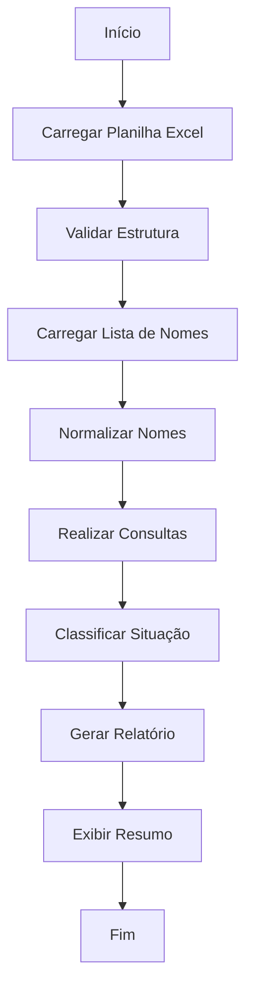

# 📚 Sistema de Consulta de Alunos em Planilha Excel

## 🤖 Sobre este Projeto

**Este código foi gerado por Inteligência Artificial (Claude - Anthropic) com auxílio humano para testes e pequenas correções.**

- **Desenvolvido por:** IA Claude (Anthropic)
- **Colaboração Humana:** Testes, validação e refinamentos
- **Versão:** 1.0
- **Data:** Dezembro 2025
- **Linguagem:** Python 3.x

---

## 📋 Índice

1. [Visão Geral](#visão-geral)
2. [Requisitos](#requisitos)
3. [Instalação](#instalação)
4. [Estrutura da Planilha](#estrutura-da-planilha)
5. [Como Usar](#como-usar)
6. [Funcionalidades](#funcionalidades)
7. [Arquitetura do Código](#arquitetura-do-código)
8. [Formato de Saída](#formato-de-saída)
9. [Solução de Problemas](#solução-de-problemas)
10. [Limitações Conhecidas](#limitações-conhecidas)
11. [Melhorias Futuras](#melhorias-futuras)

---

## 🎯 Visão Geral

Sistema automatizado para consultar nomes de alunos em planilhas Excel e gerar relatórios detalhados contendo:
- Status de conclusão (se o aluno consta ou não)
- Pontuação obtida
- Situação (APROVADO/REPROVADO)
- Data e hora de realização

O sistema realiza buscas inteligentes que ignoram acentos, maiúsculas/minúsculas e espaços extras, garantindo alta taxa de sucesso na localização dos registros.

---

## 💻 Requisitos

### Requisitos de Sistema
- **Python:** 3.7 ou superior
- **Sistema Operacional:** Windows, Linux ou macOS
- **Espaço em disco:** ~50MB (incluindo dependências)

### Bibliotecas Python Necessárias
```
pandas >= 1.3.0
openpyxl >= 3.0.0
```

### Formato de Arquivo Suportado
- Arquivos Excel (.xlsx, .xls)
- Exportados do Google Planilhas ou criados no Microsoft Excel

---

## 🔧 Instalação

### Passo 1: Instalar Python
Baixe e instale Python em [python.org](https://www.python.org/downloads/)

### Passo 2: Instalar Dependências
Abra o terminal/prompt de comando e execute:

```bash
pip install pandas openpyxl
```

### Passo 3: Baixar o Script
Salve o código Python em um arquivo, por exemplo: `consulta_alunos.py`

### Passo 4: Executar
```bash
python consulta_alunos.py
```

---

## 📊 Estrutura da Planilha

### Configuração Esperada

O sistema espera que a planilha Excel tenha **pelo menos 3 colunas** na seguinte ordem:

| Coluna | Nome Sugerido | Conteúdo | Exemplo |
|--------|---------------|----------|---------|
| **A** | Carimbo de data/hora | Data e hora da realização | 19/11/2025 16:28:32 |
| **B** | Pontuação | Nota no formato "X / Y" | 8 / 10 |
| **C** | Nome Completo | Nome do aluno | João da Silva |

### Observações Importantes

- ✅ O nome da aba/planilha **não importa** - o sistema usa automaticamente a primeira aba
- ✅ Pode haver colunas adicionais - serão ignoradas
- ✅ O sistema identifica automaticamente os nomes das colunas
- ⚠️ A ordem das colunas (A, B, C) **deve ser respeitada**

### Exemplo de Planilha Válida

```
Carimbo de data/hora    | Pontuação  | Nome Completo
------------------------+------------+---------------------------
19/11/2025 16:28:32    | 8 / 10     | João da Silva
20/11/2025 10:15:00    | 4 / 10     | Maria José Santos
21/11/2025 14:30:00    | 10 / 10    | José Araújo
```

---

## 🚀 Como Usar

### Modo Interativo (Recomendado)

1. **Execute o script:**
   ```bash
   python consulta_alunos.py
   ```

2. **Informe o caminho da planilha Excel:**
   ```
   📂 Digite o caminho completo da planilha Excel:
   Exemplo: C:\Users\SeuNome\Documents\planilha.xlsx
   Caminho: _
   ```

3. **Escolha o método de entrada dos nomes:**
   ```
   OPÇÕES DE ENTRADA DOS NOMES:
   1 - Digitar os nomes manualmente
   2 - Carregar de um arquivo .txt
   Escolha uma opção (1 ou 2): _
   ```

4. **Forneça os nomes:**
   
   **Opção 1 - Manual:**
   ```
   📝 Digite os nomes dos alunos (um por linha).
   Quando terminar, deixe uma linha em branco e pressione Enter:
   
   JOÃO DA SILVA
   MARIA SANTOS
   JOSE ARAUJO
   [linha em branco]
   ```
   
   **Opção 2 - Arquivo .txt:**
   ```
   📂 Digite o caminho do arquivo .txt com os nomes:
   Caminho: C:\Users\SeuNome\Documents\nomes.txt
   ```

5. **Opcionalmente, ative o modo DEBUG:**
   ```
   ⚙️ Deseja ativar modo DEBUG para ver detalhes da busca? (s/n): n
   ```

6. **Aguarde o processamento e localização do relatório:**
   ```
   ✅ Relatório gerado com sucesso: relatorio_alunos_20251206_143045.txt
   ```

### Formato do Arquivo .txt de Entrada

Crie um arquivo de texto com um nome por linha:

```
JOÃO DA SILVA
MARIA JOSÉ SANTOS
JOSÉ ARAÚJO
PEDRO HENRIQUE LIMA
```

**Observações:**
- Um nome por linha
- Pode usar maiúsculas, minúsculas ou misto
- Acentos são opcionais (o sistema normaliza)
- Não deixe linhas em branco entre os nomes

---

## ⚙️ Funcionalidades

### 1. Normalização Inteligente de Nomes

O sistema aplica múltiplas camadas de normalização para garantir correspondências precisas:

#### Remoção de Acentos
- **Input:** `JOSÉ ARAÚJO`
- **Normalizado:** `JOSE ARAUJO`
- **Corresponde a:** José Araújo, Jose Araujo, JOSE ARAUJO

#### Case-Insensitive (Maiúsculas/Minúsculas)
- **Input:** `joão da silva`
- **Normalizado:** `JOAO DA SILVA`
- **Corresponde a:** João da Silva, JOÃO DA SILVA, joão da silva

#### Remoção de Espaços Extras
- **Input:** `Maria  Santos` (dois espaços)
- **Normalizado:** `MARIA SANTOS`
- **Corresponde a:** Maria Santos, MARIA SANTOS

### 2. Tratamento de Duplicatas

Quando um aluno aparece múltiplas vezes na planilha:
- ✅ O sistema **seleciona automaticamente a última ocorrência**
- ✅ Útil quando alunos refazem provas/testes
- ✅ Garante que a nota mais recente seja reportada

### 3. Classificação por Aprovação

**Critério de Aprovação:** Nota ≥ 5

| Nota | Situação |
|------|----------|
| 0 - 4.9 | REPROVADO |
| 5 - 10 | APROVADO |

### 4. Modo DEBUG

Ative para troubleshooting e análise detalhada:

```
🔍 Buscando: 'CLÁUDIA SILVA SOUZA '
   Normalizado: 'CLAUDIA SILVA SOUZA'
   ⚠️ Nomes similares encontrados:
      - 'Cláudia Silva Souza' → 'CLAUDIA SILVA SOUZA'
```

Útil para:
- Identificar problemas de correspondência
- Ver como os nomes estão sendo normalizados
- Encontrar erros de digitação

### 5. Relatório Automático com Timestamp

Cada execução gera um arquivo único:
```
relatorio_alunos_20251206_143045.txt
                 └─AAAAMMDD_HHMMSS
```

Evita sobrescrever relatórios anteriores.

---

## 🏗️ Arquitetura do Código

### Estrutura de Módulos

```
consulta_alunos.py
│
├── Imports
│   ├── pandas (manipulação de dados)
│   ├── datetime (timestamps)
│   ├── os (operações de arquivo)
│   └── unicodedata (normalização de texto)
│
├── Funções Utilitárias
│   ├── remover_acentos()
│   ├── extrair_nota()
│   ├── verificar_situacao()
│   └── formatar_data()
│
├── Funções de Dados
│   ├── carregar_planilha()
│   ├── carregar_lista_nomes()
│   └── consultar_alunos()
│
├── Funções de Saída
│   └── gerar_relatorio_txt()
│
└── Função Principal
    └── main()
```

### Fluxo de Execução



### Descrição das Funções

#### `remover_acentos(texto)`
**Propósito:** Remove acentuação de caracteres.

**Parâmetros:**
- `texto` (str): Texto a ser normalizado

**Retorno:** String sem acentos

**Exemplo:**
```python
remover_acentos("José María") 
# Retorna: "Jose Maria"
```

**Implementação:** Usa decomposição NFD do Unicode para separar caracteres base de diacríticos.

---

#### `extrair_nota(pontuacao_str)`
**Propósito:** Extrai valor numérico da pontuação.

**Parâmetros:**
- `pontuacao_str` (str): String no formato "X / Y"

**Retorno:** Float ou None

**Exemplo:**
```python
extrair_nota("8 / 10")
# Retorna: 8.0
```

**Tratamento de Erros:** Retorna `None` se a conversão falhar.

---

#### `verificar_situacao(nota)`
**Propósito:** Determina se aluno foi aprovado.

**Parâmetros:**
- `nota` (float): Nota numérica do aluno

**Retorno:** "APROVADO", "REPROVADO" ou None

**Lógica:**
```python
if nota >= 5:
    return "APROVADO"
else:
    return "REPROVADO"
```

---

#### `formatar_data(data)`
**Propósito:** Formata datas para padrão brasileiro.

**Parâmetros:**
- `data` (datetime/str): Data a ser formatada

**Retorno:** String no formato "DD/MM/AAAA HH:MM:SS"

**Exemplo:**
```python
formatar_data(datetime(2025, 12, 6, 14, 30, 0))
# Retorna: "06/12/2025 14:30:00"
```

---

#### `carregar_planilha(caminho_arquivo)`
**Propósito:** Carrega e valida planilha Excel.

**Parâmetros:**
- `caminho_arquivo` (str): Caminho completo do arquivo

**Retorno:** DataFrame do pandas ou None

**Validações:**
- Verifica existência do arquivo
- Valida número mínimo de colunas
- Renomeia colunas para padrão interno

**Tratamento de Erros:**
- `FileNotFoundError`: Arquivo não existe
- `Exception`: Erros genéricos de leitura

---

#### `consultar_alunos(df, lista_nomes, debug=False)`
**Propósito:** Realiza consultas na planilha.

**Parâmetros:**
- `df` (DataFrame): Dados da planilha
- `lista_nomes` (list): Nomes a buscar
- `debug` (bool): Ativa modo debug

**Retorno:** Lista de dicionários com resultados

**Estrutura do Resultado:**
```python
{
    'nome': str,
    'status': 'CONSTA' ou 'NÃO CONSTA',
    'nota': float ou None,
    'situacao': 'APROVADO'/'REPROVADO'/None,
    'pontuacao_completa': str,
    'data_hora': str
}
```

**Algoritmo:**
1. Normaliza todos os nomes da planilha
2. Para cada nome da lista:
   - Normaliza o nome
   - Busca correspondência exata
   - Se duplicado, pega última ocorrência
   - Calcula situação

---

#### `gerar_relatorio_txt(resultados, arquivo_saida)`
**Propósito:** Gera arquivo de relatório formatado.

**Parâmetros:**
- `resultados` (list): Lista de dicionários com dados
- `arquivo_saida` (str): Nome do arquivo de saída

**Formato do Relatório:**
```
========================================
RELATÓRIO DE CONSULTA DE ALUNOS
========================================
Data de geração: DD/MM/AAAA HH:MM:SS
Total de alunos consultados: N

📊 RESUMO:
   ✓ Alunos encontrados: X
   ✗ Alunos não encontrados: Y

DETALHAMENTO POR ALUNO:
----------------------------------------

1. NOME DO ALUNO
   Status: CONSTA
   Pontuação: X / Y
   Situação: APROVADO
   Data/Hora: DD/MM/AAAA HH:MM:SS
```

---

#### `carregar_lista_nomes(caminho_arquivo=None)`
**Propósito:** Carrega nomes de arquivo ou input manual.

**Parâmetros:**
- `caminho_arquivo` (str, opcional): Caminho do .txt

**Retorno:** Lista de strings (nomes)

**Comportamento:**
- Se `caminho_arquivo` fornecido: lê do arquivo
- Senão: solicita entrada manual linha por linha

---

#### `main()`
**Propósito:** Função principal - orquestra todo o fluxo.

**Fluxo:**
1. Apresenta interface
2. Solicita caminho da planilha
3. Carrega e valida dados
4. Solicita método de entrada de nomes
5. Processa consultas
6. Gera relatório
7. Exibe resumo

---

## 📄 Formato de Saída

### Relatório Completo

```
====================================================================================================
RELATÓRIO DE CONSULTA DE ALUNOS
====================================================================================================
Data de geração: 06/12/2025 14:30:45
Total de alunos consultados: 5
====================================================================================================

📊 RESUMO:
   ✓ Alunos encontrados: 4
   ✗ Alunos não encontrados: 1

====================================================================================================

DETALHAMENTO POR ALUNO:
----------------------------------------------------------------------------------------------------

1. MÁRIO SOUZA
   Status: CONSTA
   Pontuação: 8 / 10
   Situação: APROVADO
   Data/Hora: 19/11/2025 16:28:32

2. JOÃO SILVA
   Status: CONSTA
   Pontuação: 4 / 10
   Situação: REPROVADO
   Data/Hora: 20/11/2025 10:15:00

3. MARIA DOS SANTOS
   Status: CONSTA
   Pontuação: 10 / 10
   Situação: APROVADO
   Data/Hora: 21/11/2025 09:00:00

4. JOSÉ MARIA
   Status: CONSTA
   Pontuação: 7 / 10
   Situação: APROVADO
   Data/Hora: 21/11/2025 14:30:00

5. NOME INEXISTENTE
   Status: NÃO CONSTA

====================================================================================================
FIM DO RELATÓRIO
====================================================================================================
```

### Saída no Console

```
====================================================================================================
SISTEMA DE CONSULTA DE ALUNOS EM PLANILHA EXCEL
====================================================================================================

📂 Digite o caminho completo da planilha Excel:
   Exemplo: C:\Users\SeuNome\Documents\planilha.xlsx
   Caminho: C:\Users\Christian\Desktop\planilha.xlsx

✅ Colunas identificadas:
   Coluna A (Data/Hora): 'Carimbo de data/hora'
   Coluna B (Pontuação): 'Pontuação'
   Coluna C (Nome): 'Nome Completo'

✅ Planilha carregada com sucesso! Total de registros: 50

====================================================================================================
OPÇÕES DE ENTRADA DOS NOMES:
1 - Digitar os nomes manualmente
2 - Carregar de um arquivo .txt
Escolha uma opção (1 ou 2): 1

📝 Digite os nomes dos alunos (um por linha).
Quando terminar, deixe uma linha em branco e pressione Enter:

JOÃO DA SILVA
MARIA DOS SANTOS

✅ 2 nome(s) carregado(s).

🔍 Processando consultas...

⚙️ Deseja ativar modo DEBUG para ver detalhes da busca? (s/n): n

📄 Gerando relatório...

✅ Relatório gerado com sucesso: relatorio_alunos_20251206_143045.txt

====================================================================================================
RESUMO DA CONSULTA:
====================================================================================================
✓ Alunos encontrados: 2/2
✗ Alunos não encontrados: 0/2
====================================================================================================
```

---

## 🔧 Solução de Problemas

### Problema: "Arquivo não encontrado"

**Sintoma:**
```
❌ Erro: Arquivo 'C:\caminho\arquivo.xlsx' não encontrado.
```

**Soluções:**
1. Verifique se o caminho está correto
2. Use barras duplas: `C:\\Users\\...` ou barras normais: `C:/Users/...`
3. Remova aspas do caminho se copiar do Explorer
4. Verifique se tem permissão de leitura no arquivo

---

### Problema: "Permission denied"

**Sintoma:**
```
❌ Erro ao carregar planilha: [Errno 13] Permission denied
```

**Causas Comuns:**
1. Arquivo Excel está aberto em outro programa
2. Forneceu caminho de pasta ao invés de arquivo
3. Não tem permissão de leitura

**Soluções:**
1. Feche o arquivo Excel
2. Adicione o nome do arquivo ao caminho: `pasta\arquivo.xlsx`
3. Execute com permissões adequadas

---

### Problema: "Worksheet not found"

**Sintoma:**
```
❌ Erro ao carregar planilha: Worksheet named 'Form_Responses' not found
```

**Solução:**
- Isso foi corrigido na versão atual
- O sistema agora usa automaticamente a primeira aba
- Se persistir, atualize para a versão mais recente do código

---

### Problema: Nomes não são encontrados

**Sintoma:**
```
1. JOÃO DA SILVA
   Status: NÃO CONSTA
```

**Debug:**
1. Ative o modo DEBUG: responda 's' quando perguntado
2. Verifique a saída:
   ```
   🔍 Buscando: 'JOÃO DA SILVA'
      Normalizado: 'JOAO DA SILVA'
      ⚠️ Nomes similares encontrados:
         - 'João Silva' → 'JOAO SILVA'
   ```

**Causas Comuns:**
- Nome está diferente na planilha (ex: falta sobrenome)
- Caracteres especiais não tratados
- Nome tem mais/menos espaços

**Solução:**
- Ajuste o nome na lista de busca para corresponder exatamente
- Verifique se não há caracteres invisíveis

---

### Problema: Módulo não encontrado

**Sintoma:**
```
ModuleNotFoundError: No module named 'pandas'
```

**Solução:**
```bash
pip install pandas openpyxl
```

Se usar Python 3:
```bash
pip3 install pandas openpyxl
```

---

### Problema: Encoding de caracteres

**Sintoma:**
- Caracteres especiais aparecem errados no relatório
- Acentos aparecem como símbolos estranhos

**Solução:**
- O código já usa `encoding='utf-8'`
- Verifique se seu terminal suporta UTF-8
- No Windows, pode ser necessário configurar:
  ```bash
  chcp 65001
  ```

---

## ⚠️ Limitações Conhecidas

### 1. Estrutura da Planilha
- ❌ Colunas devem estar nas posições A, B, C (nessa ordem)
- ❌ Não suporta múltiplas abas simultaneamente
- ✅ Workaround: Processe cada aba separadamente

### 2. Formato de Dados
- ❌ Pontuação deve estar no formato "X / Y"
- ❌ Outros formatos não são reconhecidos
- ✅ Workaround: Ajuste a função `extrair_nota()` para seu formato

### 3. Desempenho
- ⚠️ Para planilhas muito grandes (>100.000 linhas), o processamento pode ser lento
- ✅ Workaround: Divida a planilha em partes menores

### 4. Tipos de Arquivo
- ❌ Suporta apenas Excel (.xlsx, .xls)
- ❌ Não suporta CSV diretamente
- ✅ Workaround: Converta CSV para Excel primeiro

### 5. Nomes Complexos
- ⚠️ Nomes com caracteres especiais raros podem não funcionar
- ⚠️ Nomes com números podem causar problemas
- ✅ Teste com modo DEBUG para verificar

---

## 🚀 Melhorias Futuras

### Funcionalidades Planejadas

#### Curto Prazo
- [ ] Suporte a múltiplas abas em um arquivo
- [ ] Exportação para Excel além de TXT
- [ ] Interface gráfica (GUI) com Tkinter
- [ ] Barra de progresso para grandes consultas

#### Médio Prazo
- [ ] Suporte a CSV direto
- [ ] Geração de gráficos estatísticos
- [ ] Filtros avançados (aprovados, reprovados, por data)
- [ ] Histórico de execuções

#### Longo Prazo
- [ ] API REST para integração
- [ ] Dashboard web interativo
- [ ] Notificações por email
- [ ] Integração com Google Sheets API

### Contribuições

Este projeto foi desenvolvido por IA com auxílio humano. Sugestões de melhorias são bem-vindas!

---

## 📞 Suporte

### Problemas Comuns
Consulte a seção [Solução de Problemas](#solução-de-problemas)

### Debug
Use o modo DEBUG para análise detalhada:
- Responda 's' quando perguntado
- Observe as normalizações aplicadas
- Compare com nomes similares encontrados

### Logs
O sistema exibe mensagens detalhadas no console durante a execução.

---

## 📝 Notas de Versão

### v1.0 (Dezembro 2025)
- ✅ Primeira versão estável
- ✅ Normalização inteligente de nomes
- ✅ Tratamento de duplicatas
- ✅ Sistema de aprovação/reprovação
- ✅ Modo DEBUG
- ✅ Relatórios em TXT
- ✅ Suporte a entrada manual e arquivo
- ✅ Documentação completa

---

## 📜 Licença

Este código foi gerado por IA (Claude - Anthropic) e está disponível para uso livre.

**Isenção de Responsabilidade:**
- O código é fornecido "como está"
- Sem garantias de qualquer tipo
- Use por sua conta e risco
- Teste adequadamente antes de usar em produção

---

## 🙏 Agradecimentos

- **Claude (Anthropic):** Geração do código
- **Christian Sayão Charles:** Testes, validação e refinamentos
- **Comunidade Python:** Bibliotecas pandas e openpyxl

---

**Fim da Documentação**

*Última atualização: Dezembro 2025*  
*Gerado por: Claude (Anthropic AI)*  
*Validado por: Christian Sayão Charles*